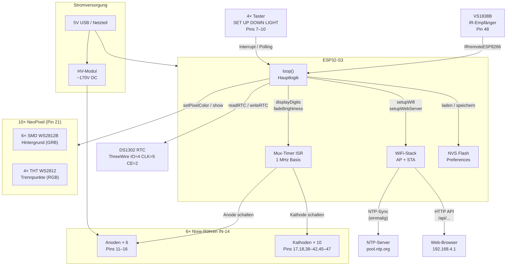

# NixieClockUltra – Blockschaltbild

## Legende

| Block | Beschreibung |
|---|---|
| **HV-Modul** | Boost-Converter, erzeugt ~170 V DC für die Nixie-Anoden |
| **Mux-Timer ISR** | Hardware-Timer (1 MHz), schaltet alle 2800 µs zur nächsten Röhre, 200 µs Blank-Phase gegen Ghosting |
| **DS1302 RTC** | Batteriegepufferte Echtzeituhr, ThreeWire-Interface |
| **NeoPixel SMD** | WS2812B, GRB-Farbreihenfolge, Pixel 0–5 (Röhren-Hintergrund) |
| **NeoPixel THT** | WS2812 (Durchsteck), RGB-Farbreihenfolge, Pixel 6–9 (Trennpunkte) |
| **NVS Flash** | Speichert Helligkeit, Animationsmodus, WiFi-Zugangsdaten, IR-Codes |
| **WiFi AP** | Immer aktiv: SSID `NixieClock`, PW `nixie1234`, IP `192.168.4.1` |
| **WiFi STA** | Optional: Heimnetz-Verbindung für NTP-Sync |
