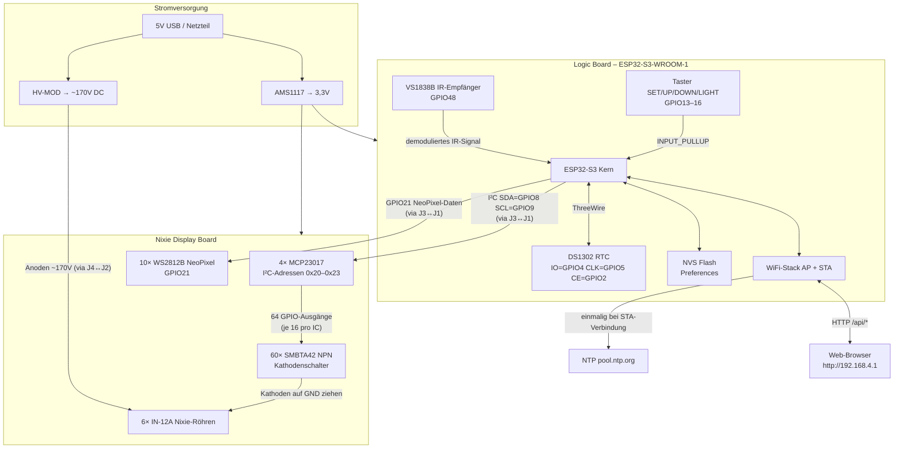

# Systemdokumentation Nixie Clock Ultra – Implementierungsplan

> **For agentic workers:** REQUIRED SUB-SKILL: Use superpowers:subagent-driven-development (recommended) or superpowers:executing-plans to implement this plan task-by-task. Steps use checkbox (`- [ ]`) syntax for tracking.

**Goal:** Drei technische Markdown-Dateien unter `docs/system/` erstellen, die Hardware-Architektur und Firmware des Nixie Clock Ultra für Dritte vollständig dokumentieren.

**Architecture:** Drei unabhängige Markdown-Dateien (README.md, hardware.md, firmware.md) mit Mermaid-Diagrammen und Tabellen. Keine Tests (reine Dokumentation), Verifikation durch Abgleich mit Firmware-Defines und KiCAD-Schaltplan-Daten.

**Tech Stack:** Markdown, Mermaid (GitHub-native), Git

---

## Quelldateien (nur lesen, nicht ändern)

| Quelldatei | Zweck |
|---|---|
| `NixieClockUltra.ino` | Defines (GPIOs, Konstanten), Globals, setup(), loop() |
| `nixie_driver.ino` | MCP23017-Adressen, digitPin[][]-Lookup-Tabelle, nixieWrite() |
| `display.ino` | Fade-In/Out, setDisplayTime() |
| `buttons.ino` | Taster-FSM |
| `rtc.ino` | readRTC(), writeRTC() |
| `neo_animation.ino` | AnimMode-Implementierungen |
| `web_server.ino` | API-Routen, WiFi-Setup, NTP |
| `blockschaltbild.md` | Altes Blockschaltbild (veraltet, wird durch Redirect ersetzt) |
| Design-Spec | `docs/superpowers/specs/2026-06-15-system-documentation-design.md` |

---

## Task 1: `docs/system/README.md`

**Files:**
- Create: `docs/system/README.md`

- [ ] **Schritt 1: Datei anlegen**

Erstelle `docs/system/README.md` mit folgendem Inhalt:

```markdown
# Nixie Clock Ultra – Systemdokumentation

Die Nixie Clock Ultra ist eine ESP32-S3-basierte Röhrenuhr mit 6 IN-12A Nixie-Röhren.
Die Hardware verteilt sich auf zwei Platinen: das **Logic Board** (ESP32-S3, RTC, HV-Versorgung)
und das **Nixie Display Board** (4× MCP23017 I²C-Expander, 60 NPN-Transistoren, NeoPixel-LEDs).
Die Nixie-Röhren werden direkt ohne Multiplexing angesteuert — jede Kathode hat einen
eigenen Transistor, was Ghosting vollständig eliminiert.

## Zweiplatinenübersicht

| Platine             | KiCAD-Projekt          | Hauptfunktion                                  |
|---------------------|------------------------|------------------------------------------------|
| Logic Board         | nixieclocklogic_V2     | ESP32-S3, DS1302 RTC, HV-Modul, Taster, IR, USB |
| Nixie Display Board | nixieclockin12_V2      | 4× MCP23017, 6× IN-12A, 60× NPN, WS2812B      |

Die Boards sind über zwei Steckverbinder verbunden:
- **J3 ↔ J1** (8-polig „Logic"): 3,3 V, GND, I²C (SDA/SCL), NeoPixel-Daten
- **J4 ↔ J2** (4-polig „HV"): ~170 V Anodenversorgung + HV-GND

## Systemblockschaltbild



## Bibliotheksabhängigkeiten

Alle Bibliotheken über den Arduino Library Manager installieren:

| Bibliothek         | Autor / Quelle    | Zweck                              |
|--------------------|-------------------|------------------------------------|
| Adafruit NeoPixel  | Adafruit          | WS2812B-Ansteuerung (GRB + RGB)    |
| Rtc by Makuna      | Michael C. Miller | DS1302 RTC über ThreeWire          |
| AsyncTCP           | me-no-dev         | Async-TCP-Basis für ESP32          |
| ESPAsyncWebServer  | me-no-dev         | Nicht-blockierender HTTP-Server    |
| ArduinoJson        | Benoit Blanchon   | JSON-Serialisierung (v6+)          |
| IRremoteESP8266    | David Conran      | IR-Empfang (NEC, Samsung, RC5 …)   |

## Weiterführende Dokumente

- **Hardware-Details:** [hardware.md](hardware.md)
- **Firmware-Architektur:** [firmware.md](firmware.md)
- **Bedienungsanleitung:** [../manual/nixie-clock-ultra-bedienungsanleitung.html](../manual/nixie-clock-ultra-bedienungsanleitung.html)
```

- [ ] **Schritt 2: Verifikation**

Prüfe in `NixieClockUltra.ino` (Zeilen 48–86) dass alle GPIO-Nummern im Blockschaltbild stimmen:
- RTC: IO=4, CLK=5, CE=2 ✓
- I²C: SDA=8, SCL=9 ✓
- Taster: 13–16 ✓
- NeoPixel: GPIO21 ✓
- IR: GPIO48 ✓

- [ ] **Schritt 3: Commit**

```bash
git add docs/system/README.md
git commit -m "docs: Systemübersicht README mit Blockschaltbild und Bibliotheksliste"
```

---

## Task 2: `docs/system/hardware.md`

**Files:**
- Create: `docs/system/hardware.md`

- [ ] **Schritt 1: Datei anlegen**

Erstelle `docs/system/hardware.md` mit folgendem Inhalt:

```markdown
# Hardware-Dokumentation

## PCB 1 – Logic Board

**KiCAD-Projekt:** `nixieclocklogic_V2` · Rev 0.9 · 2026-05-07

Das Logic Board beherbergt den Mikrocontroller, die Echtzeituhr, die Hochspannungserzeugung
und alle Nutzerschnittstellen (Taster, IR, USB). Es versorgt das Nixie Display Board
über zwei dedizierte Steckverbinder.

### Hauptkomponenten

| Ref  | Bauteil             | Funktion                                        |
|------|---------------------|-------------------------------------------------|
| U1   | ESP32-S3-WROOM-1    | Mikrocontroller, WiFi/BT, 4 MB Flash            |
| U2   | DS1302N+ (DIP-8)    | Batteriegepufferte Echtzeituhr                  |
| U3   | VS1838B             | IR-Empfänger/-Demodulator 38 kHz                |
| U4   | HV-MOD              | Boost-Converter, erzeugt ~170 V DC für Nixie-Anoden |
| U5   | AMS1117-3.3 (SOT-223)| LDO-Linearregler 5V → 3,3V                    |
| U22  | USBLC6-2SC6 (SOT-23-6)| USB-ESD-/TVS-Schutz                          |
| BT1  | CR2032              | RTC-Backup-Batterie                             |
| Y1   | 32,768 kHz Quarz    | RTC-Taktquelle                                  |
| SW1  | SET                 | Taster: Einstellmodus starten / Zeit speichern  |
| SW2  | UP                  | Taster: Wert erhöhen                            |
| SW3  | DOWN                | Taster: Wert verringern                         |
| SW4  | LIGHT               | Taster: Helligkeit / Trennpunkte                |
| SW5  | BOOT                | ESP32-Bootmodus (Programmierung)                |
| J2   | USB Micro-B         | 5V-Einspeisung und Firmware-Upload              |
| J3   | Logic (8-polig)     | Inter-Board: Logik-Signale → Nixie Display      |
| J4   | HV (4-polig)        | Inter-Board: ~170V Anodenversorgung → Display   |
| J5   | LDR (2-polig)       | Optionaler Helligkeitssensor (nicht bestückt)   |

### Versorgungsschienen

| Schiene | Spannung  | Quelle   | Verbraucher                          |
|---------|-----------|----------|--------------------------------------|
| VCC     | 5V        | J2 USB   | U4 HV-MOD, U5 AMS1117               |
| +3,3V   | 3,3V      | U5       | ESP32-S3, DS1302, VS1838B, Pull-ups  |
| HV      | ~170V DC  | U4       | Nixie-Anoden (via J4)                |
| HVgnd   | GND (HV)  | U4       | HV-Rückleiter (galvanisch getrennt)  |

---

## PCB 2 – Nixie Display Board

**KiCAD-Projekt:** `nixieclockin12_V2` · Rev 2.01 · 2026-04-06

Das Display Board enthält die eigentliche Anzeigeelektronik. Die vier MCP23017 treiben
je 16 NPN-Transistoren, die die Nixie-Kathoden individuell auf GND schalten. Die Anoden
aller Röhren liegen permanent an ~170V.

### Hauptkomponenten

| Ref      | Bauteil              | Anzahl | Funktion                                         |
|----------|----------------------|--------|--------------------------------------------------|
| U1–U4    | MCP23017-E/SO (SOIC-28) | 4   | 16-bit I²C GPIO-Expander; je 16 Ausgänge         |
| Q1–Q60   | SMBTA42 (TSOT-23)    | 60     | NPN-Transistor 300V als Kathoden-Schalter        |
| NX1–NX6  | IN-12A               | 6      | Numerische Nixie-Röhre (Aufsicht, 10 Kathoden)  |
| D1       | WS2812B-SMD (×6)     | 6      | Hintergrundbeleuchtung (Pixel 0–5, GRB)         |
| D2–D6    | WS2812B-SMD          | 5      | Zusätzliche LEDs / Trennpunkte (SMD)             |
| D7–D9    | WS2812B-THT (YF923)  | 3      | Trennpunkt-LEDs (Durchsteck, RGB)                |
| R1–R64   | 3,3 kΩ (0805)        | 64     | Basis-Vorwiderstände für Q1–Q60                  |
| R65–R70  | 10 kΩ (THT, axial)   | 6      | I²C-Pull-ups und MCP-Adress-Pull-ups             |
| C1–C4    | 100 nF (0805)        | 4      | Abblockkondensatoren je MCP23017                 |
| J1       | Logic (8-polig)      | 1      | Inter-Board: Logik-Signale ← Logic Board         |
| J2       | HV (4-polig)         | 1      | Inter-Board: ~170V ← Logic Board                 |

### MCP23017 I²C-Adressen und Röhrenzuordnung

Die Adresspins A2, A1, A0 der MCP23017 sind durch Pull-ups auf GND oder VCC verdrahtet:

| IC  | I²C-Adresse | A2 | A1 | A0 | Zuständige Röhre(n)                     |
|-----|-------------|----|----|----|-----------------------------------------|
| U1  | 0x20        | 0  | 0  | 0  | Tube 0 (Stundenzehner), Tube 1 Bits 10–15 |
| U2  | 0x21        | 0  | 0  | 1  | Tube 1 Bits 0–3, Tube 2 (Minutenzehner) |
| U3  | 0x22        | 0  | 1  | 0  | Tube 3 (Minuteneiner), Tube 4 Bits 10–15|
| U4  | 0x23        | 0  | 1  | 1  | Tube 4 Bits 0–3, Tube 5 (Sekundeneiner) |

Jeder MCP23017 hat 16 Ausgänge (GPA0–7, GPB0–7). Die Tube-zu-Bit-Zuordnung ist
im Firmware-Modul `nixie_driver.ino` als `digitPin[6][10]`-Lookup-Tabelle implementiert
(→ [firmware.md](firmware.md#nixie-ansteuerung)).

### WS2812B NeoPixel-Konfiguration

Die 10 LEDs sind als verkettete Kette an GPIO21 angeschlossen:

| Pixel | Typ           | Position      | Farbreihenfolge |
|-------|---------------|---------------|-----------------|
| 0–5   | WS2812B-SMD   | Röhrenhintergrund | GRB          |
| 6–9   | WS2812B-THT   | Trennpunkte   | RGB             |

> Die unterschiedliche Farbreihenfolge (GRB vs. RGB) der SMD- und THT-Varianten
> wird in der Firmware durch separate Farbberechnungen berücksichtigt.

---

## Inter-Board-Verbindungen

### J3 (Logic Board) ↔ J1 (Nixie Display Board) — 8-polig „Logic"

> Exakte Pin-Reihenfolge aus `nixieclocklogic_V2_BPHL.pdf` verifizieren.

| Signal  | Richtung          | Beschreibung                            |
|---------|-------------------|-----------------------------------------|
| VCC     | Logic → Display   | 3,3V Logikversorgung                    |
| GND     | —                 | Digitalmasse                            |
| SDA     | ESP32 ↔ MCP23017  | I²C Daten (GPIO8)                       |
| SCL     | ESP32 → MCP23017  | I²C Takt (GPIO9)                        |
| NEO     | ESP32 → D1        | WS2812B Datenleitung (GPIO21)           |
| —       | —                 | (reserviert)                            |

### J4 (Logic Board) ↔ J2 (Nixie Display Board) — 4-polig „HV"

| Signal | Richtung        | Beschreibung                          |
|--------|-----------------|---------------------------------------|
| HV     | Logic → Display | ~170V DC Anodenversorgung (×2 Pins)   |
| HVgnd  | —               | HV-Rückleiter (×2 Pins)              |

---

## ESP32-S3 Pin-Belegung (vollständig)

| GPIO | Signal    | Peripheral / Funktion                  |
|------|-----------|----------------------------------------|
| 2    | RTC_CE    | DS1302 Chip Enable (ThreeWire)         |
| 4    | RTC_IO    | DS1302 Data (ThreeWire)                |
| 5    | RTC_CLK   | DS1302 Clock (ThreeWire)               |
| 8    | I2C_SDA   | I²C Daten → 4× MCP23017               |
| 9    | I2C_SCL   | I²C Takt → 4× MCP23017                |
| 13   | BTN_SET   | Taster SET (INPUT_PULLUP, aktiv LOW)   |
| 14   | BTN_UP    | Taster UP (INPUT_PULLUP, aktiv LOW)    |
| 15   | BTN_DOWN  | Taster DOWN (INPUT_PULLUP, aktiv LOW)  |
| 16   | BTN_LIGHT | Taster LIGHT (INPUT_PULLUP, aktiv LOW) |
| 21   | NEO_DATA  | WS2812B DIN (10 LEDs in Kette)         |
| 48   | IR_RECV   | VS1838B demodulierter Ausgang          |
```

- [ ] **Schritt 2: Verifikation**

Gleiche die GPIO-Tabelle mit den Defines in `NixieClockUltra.ino` (Zeilen 48–67) ab.
Gleiche die MCP-Adressen 0x20–0x23 mit `nixie_driver.ino` Zeile 10 (`MCP_BASE_ADDR 0x20`) ab.

- [ ] **Schritt 3: Commit**

```bash
git add docs/system/hardware.md
git commit -m "docs: Hardware-Dokumentation PCBs, Pins, Inter-Board-Verbindungen"
```

---

## Task 3: `docs/system/firmware.md`

**Files:**
- Create: `docs/system/firmware.md`

- [ ] **Schritt 1: Datei anlegen**

Erstelle `docs/system/firmware.md` mit folgendem Inhalt:

```markdown
# Firmware-Dokumentation

Die Firmware ist als Arduino-Sketch für den ESP32-S3 geschrieben und in mehrere
`.ino`-Dateien aufgeteilt. Arduino verknüpft alle `.ino`-Dateien im Projektordner
automatisch zu einer einzigen Compilation Unit — globale Variablen und Funktionen
aus einer Datei sind in allen anderen sichtbar.

## Modulübersicht

| Datei                | Zeilen | Inhalt                                                      |
|----------------------|--------|-------------------------------------------------------------|
| `NixieClockUltra.ino`| ~360   | Globals, `setup()`, `loop()`, Edit-Mode-FSM, Slot-Animation |
| `nixie_driver.ino`   | 91     | `nixieInit()`, `nixieWrite()`, MCP23017-Abstraktion         |
| `display.ino`        | 47     | `setDisplayTime()`, Fade-In/Out-Mechanismus                 |
| `buttons.ino`        | 119    | Entprell-FSM für 4 Taster, Kurz-/Langdruck-Erkennung       |
| `rtc.ino`            | 15     | `readRTC()`, `writeRTC()` via DS1302/ThreeWire              |
| `neo_animation.ino`  | 99     | Rainbow, Statisch, Puls, Slot-Machine, Trennpunkt-Blinken  |
| `web_server.ino`     | 559    | Eingebettetes HTML/JS, alle API-Handler, WiFi-Setup, NTP   |

## Setup-Ablauf

Die `setup()`-Funktion läuft einmalig nach dem Start in dieser Reihenfolge:

1. Serial-Port öffnen (115200 Baud)
2. `nixieInit()` — I²C initialisieren, alle 4 MCP23017 auf Output-Modus setzen, alle Bits 0
3. NeoPixel-Strip initialisieren, Helligkeit aus `BRIGHTNESS_LEVELS[brightLevel]` setzen
4. RTC lesen (`readRTC()`), Uhrzeit in `curHour`, `curMin`, `curSec` laden
5. Taster-Pins konfigurieren (INPUT_PULLUP)
6. IR-Empfänger starten (`IrReceiver.begin(IR_RECV_PIN)`)
7. NVS laden — Helligkeit, Animation, WiFi-Zugangsdaten, IR-Codes, `colonAlwaysOn`
8. `setupWifi()` — AP starten (SSID: `NixieClock`, PW: `nixie1234`), ggf. STA verbinden
9. `setupWebServer()` — alle API-Routen registrieren, `server.begin()`
10. NTP konfigurieren (`configTzTime()`) — nur wenn STA-Verbindung aktiv
11. Fade-In-Flag setzen (`startFadeIn = true`), Röhren werden in `loop()` eingeblendet

## Wichtige Defines

```cpp
// GPIO-Belegung
#define RTC_IO_PIN   4      // DS1302 Data
#define RTC_CLK_PIN  5      // DS1302 Clock
#define RTC_CE_PIN   2      // DS1302 Chip Enable
#define BTN_SET      13
#define BTN_UP       14
#define BTN_DOWN     15
#define BTN_LIGHT    16
#define NEO_PIN      21
#define NEO_COUNT    10     // 6 Hintergrund + 4 Trennpunkte
#define IR_RECV_PIN  48
#define I2C_SDA      8
#define I2C_SCL      9

// Verhalten
#define FADE_STEPS          20    // Schritte für Fade-In/Out
#define FADE_INTERVAL_MS     2    // ms zwischen Fade-Schritten
#define EDIT_TIMEOUT_MS  15000    // 15 s Timeout im Einstellmodus

const uint8_t BRIGHTNESS_LEVELS[4] = {10, 30, 50, 80};  // NeoPixel-Helligkeiten
```

## Globale State-Variablen

| Variable          | Typ              | Beschreibung                                          |
|-------------------|------------------|-------------------------------------------------------|
| `displayDigits[6]`| `uint8_t[6]`     | Aktuell angezeigte Ziffern (0–9; 10 = blank)         |
| `brightLevel`     | `uint8_t`        | Helligkeitsstufe 0–3 (Index in `BRIGHTNESS_LEVELS[]`)|
| `neoBright`       | `uint8_t`        | NeoPixel-Feinwert 10–255 (Hintergrund-LEDs Pixel 0–5)|
| `colonBright`     | `uint8_t`        | NeoPixel-Feinwert (Trennpunkt-LEDs Pixel 6–9)        |
| `neoHue`          | `uint8_t`        | Auto-inkrement für Rainbow-Farbverlauf                |
| `animMode`        | `AnimMode`       | Aktueller Animationsmodus (s. u.)                     |
| `editState`       | `EditState`      | Aktueller Einstellschritt (s. u.)                     |
| `colonAlwaysOn`   | `bool`           | Trennpunkte dauerhaft an (kein Blinken)               |
| `colonStatic`     | `bool`           | Trennpunkte statisch (kein Blinken, Variante 2)       |
| `irCodes[7]`      | `uint64_t[7]`    | Angelernte IR-Codes, Index = `IrAction`-Enum-Wert    |
| `wifiStaConnected`| `bool`           | STA-Verbindung aktiv                                  |
| `ntpSynced`       | `bool`           | NTP-Synchronisierung erfolgreich                      |
| `slotActive`      | `bool`           | Slot-Machine-Animation läuft                          |
| `startFadeIn`     | `bool`           | Fade-In beim Start noch aktiv                         |

### Enumerationen

```cpp
enum AnimMode  { ANIM_RAINBOW, ANIM_STATIC, ANIM_PULSE, ANIM_SLOTS, ANIM_COUNT };
enum EditState { EDIT_NONE, EDIT_HOUR, EDIT_MIN, EDIT_SEC };
enum IrAction  {
    IR_SET, IR_UP, IR_DOWN, IR_BRIGHTNESS,
    IR_ANIM_NEXT, IR_SLOT, IR_COLON_TOGGLE,
    IR_ACTION_COUNT   // = 7
};
```

## Nixie-Ansteuerung (`nixie_driver.ino`)

Die direkte Ansteuerung ohne Multiplexing funktioniert so:

1. `nixieInit()` initialisiert den I²C-Bus und setzt alle 64 Ausgänge der 4 MCP23017
   auf Output-Modus (IODIR-Register = 0x00). Alle Ausgänge starten auf LOW (0).
2. `nixieWrite(digits[6])` berechnet für jede Röhre das zugehörige MCP-Bit über die
   Lookup-Tabelle `digitPin[tube][digit]` (Typ `DigitPin {uint8_t mcp; uint8_t bit;}`).
3. Der neue Zustand wird in `newState[4]` (Shadow-Register) zusammengestellt. Nur
   geänderte MCPs werden via I²C beschrieben (Optimierung: Vergleich mit `mcpState[]`).
4. Der Schreibzugriff ist durch einen FreeRTOS-Mutex (`nixieMutex`) geschützt, da
   `nixieWrite()` aus dem Loop-Task und aus dem Web-Server-Task aufgerufen werden kann.
5. Digit-Wert **10** → kein Bit gesetzt → Röhre ist blank (alle Kathoden HIGH).

### Tube-zu-MCP-Bit-Zuordnung

Die 60 Kathoden (6 Röhren × 10 Ziffern) verteilen sich auf die 4 MCPs wie folgt.
Jeder Eintrag in der Tabelle zeigt, welcher MCP-Index (0–3, entspricht 0x20–0x23)
und welches Bit (0–15) für Röhre N, Ziffer D aktiviert wird:

| Röhre | Anzeige      | MCP(en) | Bits                               |
|-------|--------------|---------|------------------------------------|
| 0     | Stundenzehner| 0 (0x20)| Bits 0–9 (Ziffern 1–9,0 in dieser Reihenfolge) |
| 1     | Stundeneiner | 0+1     | MCP0 Bits 10–15 + MCP1 Bits 0–3   |
| 2     | Minutenzehner| 1 (0x21)| Bits 4–13                          |
| 3     | Minuteneiner | 2 (0x22)| Bits 0–9                           |
| 4     | Sekundenzehner| 2+3    | MCP2 Bits 10–15 + MCP3 Bits 0–3   |
| 5     | Sekundeneiner | 3 (0x23)| Bits 4–13                         |

> Die genaue Bit-Reihenfolge pro Ziffer steht im `digitPin[6][10]`-Array in
> `nixie_driver.ino`. Wichtig beim Schaltplan-Abgleich: Ziffer 0 einer Röhre
> belegt nicht unbedingt Bit 0 des MCP — die Reihenfolge folgt der PCB-Verdrahtung.

## Web-API

Der HTTP-Server läuft auf Port 80. Im AP-Modus ist er unter `http://192.168.4.1`
erreichbar, im STA-Modus zusätzlich unter der vom Heimrouter zugewiesenen IP.

Alle POST-Endpunkte erwarten JSON im Request-Body (`Content-Type: application/json`).
Alle GET-Endpunkte liefern JSON zurück.

| Pfad               | Methode | Request-Body                       | Antwort / Funktion                      |
|--------------------|---------|------------------------------------|-----------------------------------------|
| `/`                | GET     | —                                  | Vollständiges Web-Interface (HTML/CSS/JS, eingebettet) |
| `/api/status`      | GET     | —                                  | `{h, m, s, brightLevel, neoBright, animMode, wifiSta, ntpSynced, colonAlwaysOn}` |
| `/api/settime`     | POST    | `{"h":H,"m":M,"s":S}`             | Zeit in DS1302 RTC schreiben            |
| `/api/bright`      | POST    | `{"level":0..3}`                   | Helligkeitsstufe setzen + NVS speichern |
| `/api/neobright`   | POST    | `{"value":10..255}`                | NeoPixel-Feinwert setzen + NVS          |
| `/api/anim`        | POST    | `{"mode":0..3}`                    | Animationsmodus setzen + NVS            |
| `/api/colonbright` | POST    | `{"value":0..255}`                 | Trennpunkt-Helligkeit setzen            |
| `/api/colonon`     | POST    | `{"on":true\|false}`               | Trennpunkte dauerhaft an/aus + NVS      |
| `/api/colonstatic` | POST    | `{"static":true\|false}`           | Trennpunkte statisch (kein Blinken)     |
| `/api/slot`        | POST    | —                                  | Slot-Machine-Animation sofort auslösen  |
| `/api/wifi`        | GET     | —                                  | `{apIP, staIP, staConnected, ntpSynced}`|
| `/api/wifi`        | POST    | `{"ssid":"…","password":"…"}`      | STA-Verbindung herstellen, Neustart     |
| `/api/wifi/scan`   | GET     | —                                  | Liste verfügbarer WLANs als JSON-Array  |
| `/api/ir/status`   | GET     | —                                  | Aktuelle IR-Code-Belegung (7 Einträge)  |
| `/api/ir/learn`    | POST    | `{"action":0..6}`                  | IR-Lernmodus starten (Timeout 10 s)     |
| `/api/ir/clear`    | POST    | `{"action":0..6}`                  | IR-Code für Funktion löschen + NVS      |

## NVS-Persistenz

Alle Einstellungen werden bei Änderung sofort in den ESP32-NVS-Flash geschrieben
(über `Preferences`-Bibliothek, Namespace `nixie`). Beim Start werden sie automatisch
geladen.

| NVS-Schlüssel    | Typ     | Standardwert | Inhalt                              |
|------------------|---------|--------------|-------------------------------------|
| `brightLevel`    | UInt8   | 3            | Helligkeitsstufe (0–3)              |
| `neoBright`      | UInt8   | 30           | NeoPixel-Feinwert Hintergrund       |
| `animMode`       | UInt8   | 0            | Animationsmodus (AnimMode-Enum)     |
| `colonAlwaysOn`  | Bool    | false        | Trennpunkte dauerhaft an            |
| `colonStatic`    | Bool    | false        | Kein Blinken der Trennpunkte        |
| `wifiSSID`       | String  | `""`         | Heimnetz SSID                       |
| `wifiPass`       | String  | `""`         | Heimnetz Passwort                   |
| `irCode_0`       | UInt64  | 0            | IR-Code für IR_SET                  |
| `irCode_1`       | UInt64  | 0            | IR-Code für IR_UP                   |
| `irCode_2`       | UInt64  | 0            | IR-Code für IR_DOWN                 |
| `irCode_3`       | UInt64  | 0            | IR-Code für IR_BRIGHTNESS           |
| `irCode_4`       | UInt64  | 0            | IR-Code für IR_ANIM_NEXT            |
| `irCode_5`       | UInt64  | 0            | IR-Code für IR_SLOT                 |
| `irCode_6`       | UInt64  | 0            | IR-Code für IR_COLON_TOGGLE         |
```

- [ ] **Schritt 2: Verifikation**

- Modul-Zeilenzahlen gegen `wc -l *.ino` prüfen
- API-Endpunkte gegen `web_server.ino` (alle `server.on(...)` Aufrufe) abgleichen
- NVS-Schlüssel gegen die `preferences.put*()` / `preferences.get*()` Aufrufe in `NixieClockUltra.ino` und `web_server.ino` abgleichen
- Enum-Werte gegen `NixieClockUltra.ino` Zeilen 121–178 abgleichen

- [ ] **Schritt 3: Commit**

```bash
git add docs/system/firmware.md
git commit -m "docs: Firmware-Dokumentation Module, API-Endpunkte, NVS-Persistenz"
```

---

## Task 4: `blockschaltbild.md` Redirect

**Files:**
- Modify: `blockschaltbild.md`

- [ ] **Schritt 1: Datei mit Redirect-Hinweis ersetzen**

Ersetze den gesamten Inhalt von `blockschaltbild.md` mit:

```markdown
# Blockschaltbild

> **Dieses Dokument ist veraltet** (Stand: Multiplexing-Architektur vor MCP23017-Umbau).
>
> Die aktuelle Systemdokumentation mit aktualisiertem Blockschaltbild befindet sich unter:
> **[docs/system/README.md](docs/system/README.md)**
```

- [ ] **Schritt 2: Commit**

```bash
git add blockschaltbild.md
git commit -m "docs: blockschaltbild.md Redirect auf docs/system/README.md"
```
