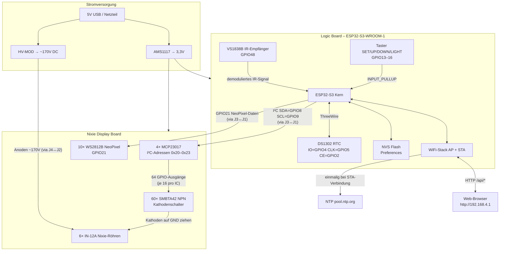

# Nixie Clock Ultra – Systemdokumentation

Die Nixie Clock Ultra ist eine ESP32-S3-basierte Röhrenuhr mit 6 IN-12A Nixie-Röhren.
Die Hardware verteilt sich auf zwei Platinen: das **Logic Board** (ESP32-S3, RTC, HV-Versorgung)
und das **Nixie Display Board** (4× MCP23017 I²C-Expander, 60 NPN-Transistoren, NeoPixel-LEDs).
Die Nixie-Röhren werden direkt ohne Multiplexing angesteuert — jede Kathode hat einen
eigenen Transistor, was Ghosting vollständig eliminiert.

## Zweiplatinenübersicht

| Platine             | KiCAD-Projekt          | Hauptfunktion                                  |
|---------------------|------------------------|------------------------------------------------|
| Logic Board         | nixieclocklogic_V2     | ESP32-S3, DS1302 RTC, HV-Modul, Taster, IR, USB |
| Nixie Display Board | nixieclockin12_V2      | 4× MCP23017, 6× IN-12A, 60× NPN, WS2812B      |

Die Boards sind über zwei Steckverbinder verbunden:
- **J3 ↔ J1** (8-polig „Logic"): 3,3 V, GND, I²C (SDA/SCL), NeoPixel-Daten
- **J4 ↔ J2** (4-polig „HV"): ~170 V Anodenversorgung + HV-GND

## Systemblockschaltbild

## Bibliotheksabhängigkeiten

Alle Bibliotheken über den Arduino Library Manager installieren:

| Bibliothek         | Autor / Quelle    | Zweck                              |
|--------------------|-------------------|------------------------------------|
| Adafruit NeoPixel  | Adafruit          | WS2812B-Ansteuerung (GRB + RGB)    |
| Rtc by Makuna      | Michael C. Miller | DS1302 RTC über ThreeWire          |
| AsyncTCP           | me-no-dev         | Async-TCP-Basis für ESP32          |
| ESPAsyncWebServer  | me-no-dev         | Nicht-blockierender HTTP-Server    |
| ArduinoJson        | Benoit Blanchon   | JSON-Serialisierung (v6.x, nicht v7) |
| IRremoteESP8266    | David Conran      | IR-Empfang (NEC, Samsung, RC5 …)   |

## Weiterführende Dokumente

- **Hardware-Details:** [hardware.md](hardware.md)
- **Firmware-Architektur:** [firmware.md](firmware.md)
- **Bedienungsanleitung:** [../manual/nixie-clock-ultra-bedienungsanleitung.html](../manual/nixie-clock-ultra-bedienungsanleitung.html)
